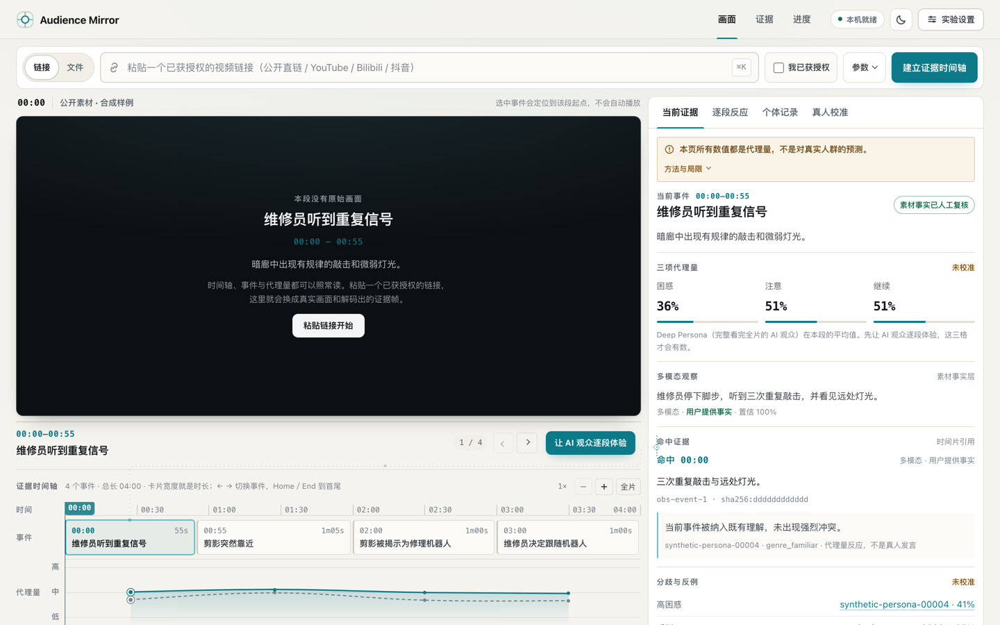

# Audience Mirror｜观众镜

> 在现实发生前，先让一万种人走一遍。

[](LICENSE)
[](https://github.com/YunyueLi/audience-mirror/actions/workflows/ci.yml)
[](https://github.com/YunyueLi/audience-mirror/actions/workflows/pages.yml)

**Developer Preview `v0.2.0-alpha.3` candidate** — 链接优先的真实视频实验、可回放顺序体验、公开视频 Benchmark、组件系统与真人盲测合同；不是经过真人验证的预测产品。

Audience Mirror 是一个开放的“现实之前人群实验层”：让异质 Persona 按顺序进入内容、软件、游戏或社会情境，形成体验、判断、选择并相互影响；每条结论都能回到环境状态、个体 Trace、实验条件和真人校准。这里的 Audience 指面对某项内容、产品、规则或世界的目标人群，不只指影视观众。

Audience Mirror is an open, pre-reality population experimentation platform.
It simulates how heterogeneous people experience, judge, choose, and influence
each other across multimodal environments, while keeping every result linked
to inspectable traces, conditions, and human calibration status.



上图使用仓库自带的合成 Timeline 与合成 Persona，不包含第三方媒体、真人数据或远程模型结果。

**[打开公开体验](https://yunyueli.github.io/audience-mirror/)**：可直接浏览合成实验、证据时间轴、逐段反应、个体 Trace、规模口径、明暗主题和[组件系统](https://yunyueli.github.io/audience-mirror/components.html)。这是只读静态 Demo，只包含确定性合成 Fixture，0 位真人；不会上传链接、调用模型或保存输入。真实视频链接、本地文件、模型 Agent 与 Human Anchors 请使用下方本机工作台。

**影视／IP 是 Audience Mirror 的首个验证环境，不是项目总边界。** 它先用内容体验验证多模态顺序体验与证据链；平台内核保持 Environment、Population、Experience、Decision、Interaction、Trace 和 Calibration 的通用抽象。当前状态为 **Conditional Go（有条件推进）**：值得用 2—4 周完成首个可运行且能与真人结果盲测的参考环境，尚不足以承诺准确预测票房、收入或现实人群比例。

基线日期：2026-08-21。

## 当前可运行基线

仓库现在有两条可运行路径。

零 Key 工程基线使用合成 Timeline 和 Persona Fixture，跑通：

```text
10k Persona Pool
  → 12 个 Deep Persona / 48 条可哈希校验 Trace
  → 100 个 Broad Sweep
  → 10k 条零逐人 LLM Projection
  → 自包含证据报告
```

真实视频路径已跑通：本地 MP4 解码与音轨抽取、关键帧／场景差分、平台人工字幕、Timeline、Environment Contract、Future-blind 顺序体验、个体 Trace、校准指标和交互式证据工作台。Gemini 原生整片视频 Adapter、Codex 固定证据帧视觉基线、Codex CLI 与 Claude Code 结构化顺序推理 Adapter 均已实现；多模态结果会从稠密镜头证据重建为最多 16 个语义体验事件，Provider 未覆盖的时间窗会显式保留。平台链接存在人工 WebVTT 时，系统只选取一条有上限的字幕轨并按时间附加到事件；该证据不等同于经过核对的 ASR 或说话人识别。

GPT-5.6 Sol／xhigh 已在公开合成 Timeline 上完成 1 Persona × 4 Event 的真实模型 Session。随后，Codex 视觉基线在公开合成 H.264 视频的 2 张真实解码帧上识别出画面颜色与计时文字变化，用 26,693 ms 生成 2 个带不确定性的语义事件；同一 Timeline 又完成 1 Persona × 2 Event 的真实顺序体验，2 次模型调用合计 34,571 ms，Trace 与 Timeline 合同全部通过。

首个公开长片纵向闭环也已跑通：从 Blender Foundation 官方 YouTube 页面导入《Sintel》完整 888 秒影片，本地解码 21,313 帧并保留 148 张证据帧；Codex 按时间分层选取其中 12 张，用 127,779 ms 重建 12 个语义体验事件。1 个模型 Persona 随后按时间顺序完成 12 次 GPT-5.6 Sol／xhigh 调用，合计模型时延 252,507 ms，12 条 Trace 与 Timeline 合同全部通过。轨迹显示黑屏、世界展开、巨型生物对峙和片尾阶段存在不同的注意／困惑代理量，但这只是一个未校准合成 Persona 的可检查输出。固定帧路径没有发送原视频或音轨，不等于原生完整视频理解，也不证明真人预测效果。本轮仍没有可用 Gemini Key，不能把 Gemini 原生视频 Provider 代码写成“真实模型结果已验证”。

两条路径都只证明工程合同和下钻链路可以工作，不证明虚拟用户能预测真人。

工作台中的校准入口可先加载 `fixtures/public-demo/human-anchors.synthetic.json` 检查合同、撤回排除、A/B 方向和指标展示。该文件全部为合成记录，只是界面 Fixture，不是“真人校准已经完成”的证据。

`audience-mirror prepare-blind-study` 可从一个或两个冻结 Timeline 生成匿名、结果盲法的真人研究包：单版本用于探索性收敛，双版本自动形成尽量均衡的 AB／BA 暴露顺序，并把参与者包与研究者解盲密钥分开。计划槽位始终不计入真人样本；详见[真人盲测包](docs/15-blind-study-packet.md)。

### 直接运行

要求 Python 3.11 或更高版本。零 Key Demo 无运行时依赖：

```bash
git clone https://github.com/YunyueLi/audience-mirror.git
cd audience-mirror
python3 -m venv .venv
source .venv/bin/activate
python -m pip install .
audience-mirror demo
```

如需复现公开静态体验的数据包：

```bash
audience-mirror export-static-demo --output web/static-demo.js
```

该命令只导出仓库内的合成 Fixture 与确定性运行结果，不读取本机实验、媒体、密钥或真人记录。

安装真实媒体解析和本地工作台：

```bash
python -m pip install '.[media,web]'

# 把有权处理的本地视频转成可校验 Timeline
audience-mirror ingest-video /path/to/public-or-authorized.mp4 \
  --output artifacts/my-video

# 输出与媒体无关的 Environment Contract
audience-mirror environment-spec \
  --timeline artifacts/my-video/timeline.json \
  --output artifacts/my-video/environment.json

# 可选：把有权使用的人工 WebVTT 作为独立证据附加到事件
audience-mirror attach-subtitles \
  --timeline artifacts/my-video/timeline.json \
  --subtitle /path/to/authorized-caption.vtt \
  --language zh-Hans \
  --output artifacts/my-video/timeline-with-captions.json

# 打开交互工作台；默认只监听本机
audience-mirror serve --host 127.0.0.1 --port 8765
```

Wheel 会携带合同 Schema、公开 Fixture 和工作台静态资源，安装后可脱离源码目录运行。默认把可写制品放在当前工作目录；可通过 `AUDIENCE_MIRROR_WORKSPACE=/path/to/workspace` 指定单独工作区。README 使用标准 wheel 安装，避免部分 macOS／Python 3.13 组合跳过 editable `.pth` 文件。

工作台默认接受公开 HTTP(S) 视频直链，以及经用户确认有权测试的 YouTube、Bilibili 和抖音页面链接；本地文件上传为备用入口。公共直链在每次重定向时解析公共地址，并把真实连接固定到该次已验证 IP。平台页通过独立 `yt-dlp` Adapter 获取，分离音视频由 PyAV 在本地无转码合并，因此不要求单独安装系统级 FFmpeg；该 Adapter 仍属于外部网络信任边界，只适用于默认回环地址上的单用户原型，不应把当前服务直接暴露到不可信网络。平台登录、Cookie、地区和版权访问限制仍然生效。Source Receipt 不保存 Cookie、凭据、签名参数或通用 URL 路径，只允许保留 YouTube `v` 等明确允许的公开内容标识。实验索引、Timeline、Trace、校准和脱敏处理回执会从本地制品恢复，服务重启后可在“最近实验”中继续打开；这仍是单机文件持久化，不是多用户数据库。

可选的原生视频模型路径必须显式授权远程处理：

```bash
python -m pip install '.[gemini]'
export GEMINI_API_KEY='...'
audience-mirror analyze-video /path/to/authorized.mp4 \
  --timeline artifacts/my-video/timeline.json \
  --allow-remote-processing
```

模型驱动的 Persona 顺序体验可使用本机已认证的 Codex CLI 或 Claude Code CLI，并默认限制 16 次逐事件调用。每次都必须显式确认发送 Timeline 事实、Persona 与此前记忆；原视频文件不会进入这一 Reasoner 调用：

```bash
audience-mirror run-agent \
  --timeline artifacts/my-video/timeline.json \
  --reasoner codex-cli \
  --model gpt-5.6-sol \
  --effort xhigh \
  --persona-count 2 \
  --max-model-calls 16 \
  --allow-remote-processing
```

运行同时写出 `traces.json` 与 `run-manifest.json`，后者区分计划／实际模型调用、会话结局、时延、可得成本信息、模型指纹和校准状态。Claude Code 路径可另加 `--max-budget-usd` 作为单次 CLI 调用上限。

机密／受限素材默认拒绝发送到公有 Gemini Adapter 或 CLI Reasoner；任何远程模型使用前仍须确认授权、保留、训练使用、地域和删除策略。

输出位于 `artifacts/public-demo/`：

- `report.html`：可筛选、可下钻的本地报告；
- `run-manifest.json`：数量口径、运行指纹、成本和限制；
- `deep-traces.json`：符合 Trace v0.1 的不可变事件流；
- `broad-sweep.json` 与 `population-projection.json`：分别标记非完整观看与零 LLM 投影；
- `matraix-media-contract.json`：合同级 Adapter 输出，不执行或下载 MatrAIx。

验证与测试：

```bash
audience-mirror validate timeline fixtures/public-demo/timeline.json
audience-mirror benchmark validate fixtures/benchmarks/sintel-public-dev-v0.1.json
python -m unittest discover -s tests -v
```

### 公开视频 Benchmark

仓库包含一套不附带影片文件的《Sintel》公开开发集。31 道题覆盖视觉事实、片尾 OCR、平台人工字幕、时间定位、事件顺序和跨事件理解；每题都登记证据时间窗、模态和来源。当前标注状态为 `single_maintainer_draft`：已有一位维护者按公开影片、人工字幕和时间戳帧建立答案，但尚未完成第二位独立人工复核，所以不能称为冻结测试集。

Provider 输出使用独立 Predictions 合同，评分时同时报告答案、时间区间 IoU 和证据命中，未回答题目不会被忽略：

```bash
audience-mirror benchmark score \
  --benchmark fixtures/benchmarks/sintel-public-dev-v0.1.json \
  --predictions /path/to/provider-predictions.json \
  --output artifacts/benchmark/report.json

# 只比较同一模型、同一 Timeline、同一证据条件的重复运行
audience-mirror benchmark stability \
  --benchmark fixtures/benchmarks/sintel-public-dev-v0.1.json \
  --predictions run-1.json run-2.json run-3.json \
  --output artifacts/benchmark/stability-report.json
```

还可以先跑一个明确受限的语义 Timeline 文本基线。它只把事件事实与问题发送给已认证 CLI，不发送原视频、音轨或证据帧：

```bash
audience-mirror benchmark run-timeline \
  --benchmark fixtures/benchmarks/sintel-public-dev-v0.1.json \
  --timeline /path/to/authorized-sintel-timeline.json \
  --reasoner codex-cli \
  --model gpt-5.6-sol \
  --effort xhigh \
  --allow-remote-processing \
  --output artifacts/benchmark/predictions.json
```

首轮真实运行用 1 次 50.3 秒调用返回 31 条预测：宏平均 64.5%，主动弃答 10 道；视觉与片尾 OCR 均为 100%，对白为 0%。这个结果证明评分链路能暴露缺失模态，不代表原生视频模型达到相同分数。详见[首轮基线记录](docs/13-sintel-timeline-baseline-2026-08-20.md)。

完整口径见[公开视频 Benchmark](docs/12-public-video-benchmark.md)。它评估视频事实和证据回查，不评估审美偏好、购买意愿或真人预测准确率。

同一无字幕语义 Timeline 的三次 GPT-5.6 Sol／xhigh 重复运行得到 62.4% 宏平均（58.1%—64.5%），参考得分在 2/31 题变化；加入平台人工字幕后的三次重复得到 81.7% 宏平均（80.6%—83.9%），对白均值从 0% 升至 86.7%，但视觉事实从 96.7% 降至 80%。两组都是技术重复，`human_sample_size` 仍为 0；差值支持继续做字幕消融，不等于真人预测。详见[稳定性与字幕增量基线](docs/14-sintel-stability-and-caption-baseline-2026-08-21.md)。

同一无字幕条件还完成一次 GPT-5.6 Terra／xhigh 敏感性探针，宏平均 64.5%，落在 Sol 三次范围内；这是单次跨模型对照，不能当作模型等价或跨模型稳定性结论。

如果已有外部 MatrAIx Checkout，可检查固定版本和许可边界：

```bash
audience-mirror matraix-doctor --repo /path/to/MatrAIx
```

代码使用 [Apache License 2.0](LICENSE)。本仓库不捆绑第三方代码、模型权重、Persona 数据集或媒体素材；具体边界见 [THIRD_PARTY.md](THIRD_PARTY.md)。

## 一页结论

| 决策 | 当前建议 |
| --- | --- |
| 项目命题 | 在现实发生前，对不同人群如何体验、评价、选择和相互影响进行可回放、可校准的模拟实验 |
| 平台边界 | 通用 Experiment Core + 可插拔 Media／Web／App／Game／Social Environment；不同时开发全部环境 |
| 首个环境 | Media：影视／剧集／IP 内容及营销素材的发布前观看体验测试 |
| 首个客户 | 有目标人群数据、多个素材版本和既有真人研究记录的内容平台或 IP 商业化团队 |
| 通用差异 | 顺序经历、长期记忆、个体 Trace、环境版本对齐、条件语境、群体互动与真人校准 |
| 第一个 Demo | Blender 开放短片《Sintel》全片体验 Trace，加同源两版预告片 A/B |
| 工程形态 | 逐步抽象通用实验合同；先实现 Media Environment，并适配 MatrAIx、Foreworld／GAIA 等开放运行时 |
| 规模方式 | 大 Persona 池用于检索；12—32 个 Deep Trace、100—1,000 个 Broad Sweep、10k+ 低成本投影分别报告 |
| 产品形态 | 暂按“开放内核倾向”设计；用社区复用与私有试点两类信号决定全开源、open-core 或闭源 |
| 游戏方向 | 第二阶段先测 PV、皮肤、Battle Pass、商城 UI、玩法录像和可点击原型；完整 Build 试玩后置 |
| 明确禁区 | 不用 Agent 数量伪造统计显著性，不把模型分数写成真实注意力或确定性营收预测 |

Audience Mirror 所在的影视垂直已经有强竞品：[aiScreeningRoom](https://aiscreeningroom.com/) 在 2026 年 Beta 中宣传完整影片、多次观看、逐分钟反馈、时间戳证据和真人 Panel 校准；[Largo Content Insights](https://home.largo.io/largo-content-insights/) 也已支持脚本／视频、数字孪生焦点组、情绪分析和影视预测。这个事实说明首个垂直存在采购类别，也说明“虚拟观众”本身不能承担整个平台的差异与叙事。

[MiroFish](https://github.com/666ghj/MiroFish) 的宽叙事和 [MatrAIx](https://github.com/MatrAIx-ai/MatrAIx-Persona-8B) 的多环境结构提供了另一层启示：平台可以面向广泛人群实验，同时用一个具体环境先证明技术与有效性。详见[平台命题](docs/00-platform-thesis.md)。

## 文档地图

0. [平台命题](docs/00-platform-thesis.md)：通用愿景、三层结构、环境边界、开源／商业结构与本轮纠偏。
1. [机会判断](docs/01-opportunity-assessment.md)：平台机会、首个垂直、买方、竞争格局、证据与假设。
2. [产品需求文档](docs/02-prd.md)：定位、首客、工作流、输出、下钻体验、边界与非目标。
3. [技术架构与 MVP](docs/03-architecture-and-mvp.md)：模型无关管线、时间轴、状态机、Trace、校准、安全和 2—4 周范围。
4. [验证计划](docs/04-validation-plan.md)：公开 Demo、私有试点、盲测指标、成功门槛和停止条件。
5. [证据登记册](docs/05-evidence-register.md)：公开来源、证据等级、私密资料脱敏方式与未决研究。
6. [决策与下一步](docs/06-recommendation.md)：仓库选择、品牌表达、阶段路线与应立即制作的 Demo。
7. [开源生态与规模策略](docs/07-open-ecosystem-and-scale-strategy.md)：MatrAIx 核验、开源复用、三层执行成本和产品形态门槛。
8. [规模与开源策略决策报告](docs/reports/2026-08-19-scale-open-strategy/report.html)与 [QA 记录](docs/reports/2026-08-19-scale-open-strategy/source-notes.md)：可独立阅读的自包含 HTML 与验证说明。
9. [可运行工程基线](docs/08-implementation-baseline.md)：CLI、三层运行时、MatrAIx 合同、输出制品和下一步实现顺序。
10. [产品上下文](PRODUCT.md) 与 [设计系统](DESIGN.md)：固化用户、定位、无障碍要求、视觉 token 和证据交互规则。
11. [2026-08-20 新增外部输入复核](docs/09-external-input-review-2026-08-20.md)：记录脱敏一手信号、数字分身交叉检查、三篇公开文章及对接受语境与产品边界的净修正。
12. [视频理解与视频 Agent 技术版图](docs/10-video-understanding-landscape-2026-08-20.md)：复核抖音 AI 解析、火山 Aideo、LibTV、MiniMax Design、原生模型、长视频 Agent 论文与开源项目，并给出 build／buy 决策。
13. [v0.2 本地发布候选状态](docs/11-release-candidate-status-2026-08-20.md)：精确列出可发布面、不可声称项、首个 Benchmark 与仍需授权的对外动作。
14. [Schema 状态](schemas/README.md)、[Environment](schemas/environment.schema.json)、[Trace](schemas/trace.schema.json)、[Timeline](schemas/timeline.schema.json) 与 [Human Anchor](schemas/human-anchor.schema.json)：供原型直接实现和验收。
15. [公开视频 Benchmark](docs/12-public-video-benchmark.md)：31 道公开开发题、标注成熟度、Predictions 合同和三类评分口径。
16. [Sintel 语义 Timeline 首轮基线](docs/13-sintel-timeline-baseline-2026-08-20.md)：真实模型运行、分项结果、主动弃答与下一组对照。
17. [Sintel 稳定性与人工字幕增量](docs/14-sintel-stability-and-caption-baseline-2026-08-21.md)：无字幕与人工字幕条件各三次重复、答案／证据漂移与分模态差异。
18. [真人盲测包](docs/15-blind-study-packet.md)：匿名槽位、结果盲法、A/B 反平衡、密钥隔离和 Human Anchor 导入顺序。
19. [公开 Demo 与部署边界](docs/16-public-demo-deployment.md)：静态只读能力、本机完整能力、组件库和 GitHub Pages 发布合同。

## 研究口径

- **A1 级**：同行评审论文或正式录用的会议论文。
- **A2 级**：官方技术文档、许可证或可复核代码。
- **A3 级**：方法清楚但尚未同行评审的预印本。
- **B 级**：厂商官方功能、定价与客户范围，只证明“它公开这样销售”，不自动证明效果。
- **C 级**：经脱敏的一手访谈、业务经历与体验记录，用于发现需求和设计场景，不外推市场规模。
- **D 级**：公开访谈、二级报道或行业评论，用于发现方向与可证伪机制，技术数字和因果结论必须回到一级来源。
- **H 级**：需要实验验证的产品或技术假设。

仓库没有复制任何私密逐字稿、真实人名、未公开客户信息或本地资料路径。

## Audience Mirror 首个验证需要确认的三个高价值问题

1. 私有试点的第一个真实决策对象，能否优先选“预告片／营销短视频 A/B”？它比完整粗剪更容易在四周内形成版本差异与真人盲测闭环。
2. 授权方能否提供同一素材的既有真人问卷／访谈编码，或支持按预注册指标制定真人样本计划？10—20 人只适合探索性问题发现，不能同时承担三分群、双版本、校准和封存验收。
3. 未来试点是否要求境内私有化／VPC 和素材不出域？这会直接决定模型路由、媒体存储和成本方案。

在这三个问题确认前，最合理的投入是完成 Audience Mirror 公开 Demo、通用 Environment Contract、MatrAIx Adapter Spike 与验证工具链。大规模 Persona 由开放数据与索引提供，完整体验按信息价值分层运行；不扩招，也不采购大规模算力。
